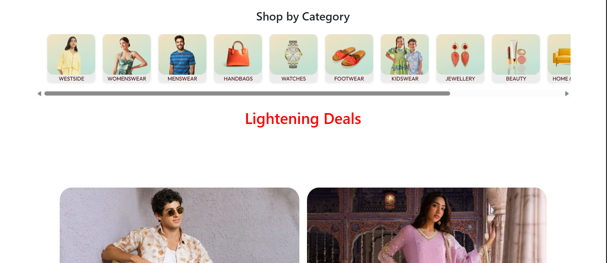
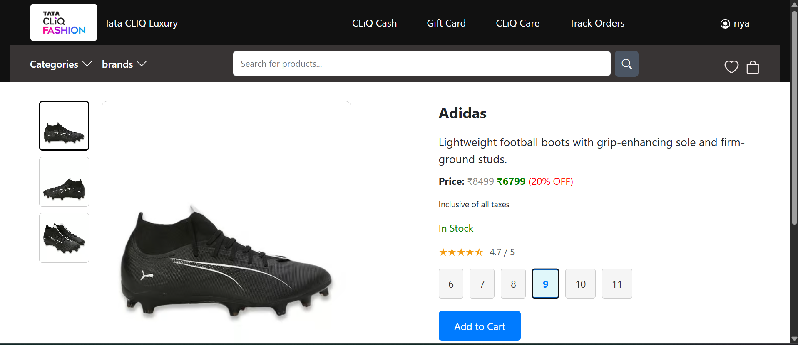
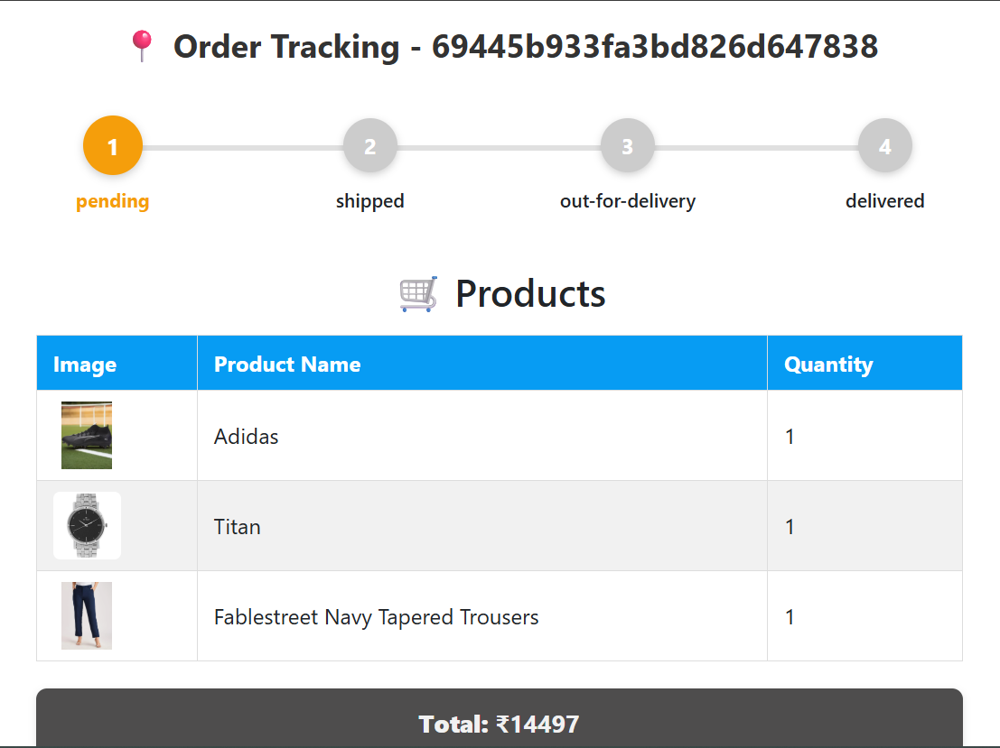
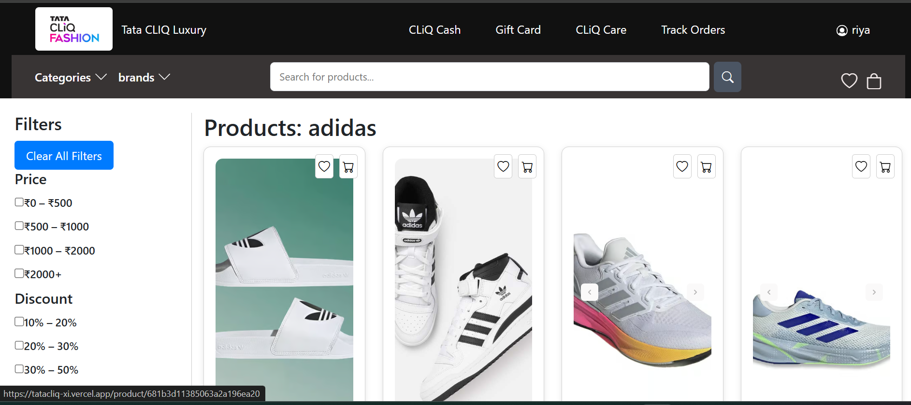
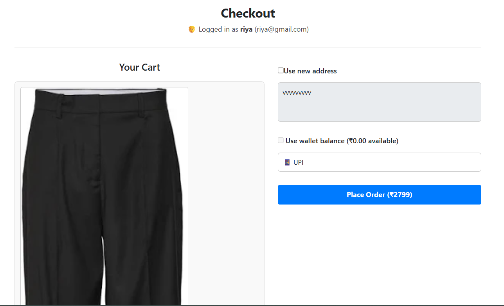
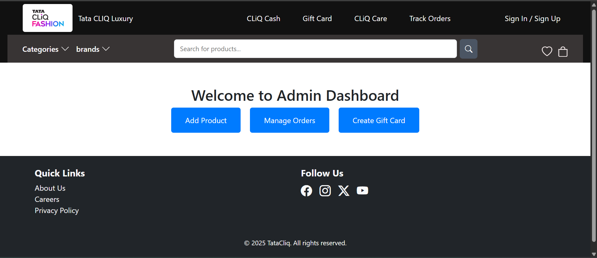
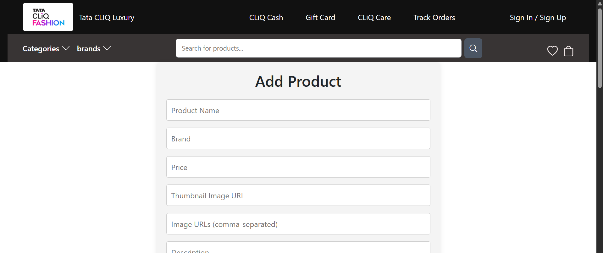
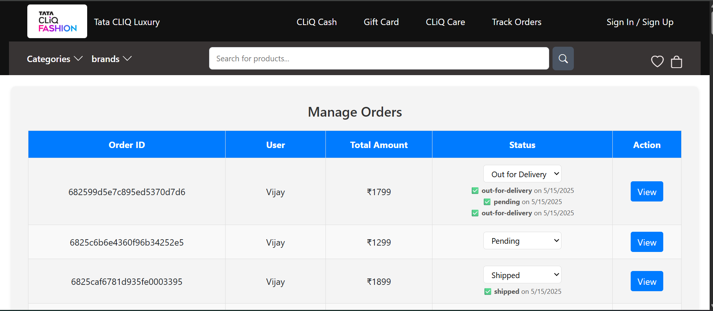

# 🛍️ TataCliq Clone

A full-stack TataCliq E-commerce Clone built using the MERN (MongoDB, Express.js, React.js, Node.js) stack.  
This project replicates core TataCliq features, including user authentication, product listing, cart, order management, and a robust admin dashboard.

---

## 🔗 Live Demo

**Full Application:** https://tatacliq-xi.vercel.app/  

This live deployment includes both the frontend and backend, showcasing the complete flow: signup/login, browsing products, cart operations, checkout, and payment.

---

## 📘 About the Project

The TataCliq Clone is a feature-rich e-commerce web application inspired by TataCliq, designed for seamless user experience and modern development best practices.

### Tech Stack

- React, JavaScript, HTML, CSS  
- Node.js, Express.js  
- MongoDB  
- JWT (JSON Web Tokens)  
- Stripe API  

### Architecture

- MERN stack with a RESTful API backend  
- Responsive React frontend with protected routes  

### Key Modules

- **Authentication:** JWT-based signup/login and route protection  
- **Product Management:** Admin dashboard to add, update, and manage products via protected APIs  
- **Cart & Orders:** Add-to-cart, update quantity, and place orders securely  
- **Payments:** Stripe API integration for real-time payment processing  
- **Deployment:** Docker-ready setup with environment variable management, suitable for cloud hosting  

---

## 🛠️ Features

- Responsive e-commerce UI with product browsing and search  
- Secure user authentication (JWT) and protected routes  
- Dynamic admin dashboard for product and order management  
- REST APIs for products, orders, users, and authentication  
- Optimized database queries for better performance  
- Real-time, secure payments with Stripe integration  
- Docker and CI/CD–friendly setup with automated deployment scripts  

---

## 📂 Folder Structure

tataCliqClone/
├── backend/ # Node.js, Express.js, MongoDB REST API
├── frontend/ # React.js single-page application
├── README.md
├── docker-compose.yml
└── .gitignore

---

## 🚀 Getting Started

### 1. Clone the Repository

git clone https://github.com/jayasingh31dec/tataCliqClone.git
cd tataCliqClone

### 2. Install Dependencies

**Frontend**

cd frontend
npm install

**Backend**

cd ../backend
npm install

### 3. Configure Environment Variables

Create a `.env` file inside `backend/`:

MONGO_URL=your_mongodb_uri
JWT_SECRET=your_jwt_secret
STRIPE_SECRET_KEY=your_stripe_secret
PORT=3000

### 4. Start Development Servers

**Backend**

cd backend
npm start

**Frontend**

cd ../frontend
npm start

App will run on your configured frontend URL (for example `http://localhost:3005`) and backend on `http://localhost:3000`.

---

## 🖼️ Screenshots

**Home Page**

! [Home Page](Homepage1.png)

**Categories & Deals**

**Product Listing (Filters)**

**Product Details**

**Cart & Checkout**

**My Orders & Tracking**

**Admin Dashboard**

**Add Product (Admin)**

**Manage Orders (Admin)**

